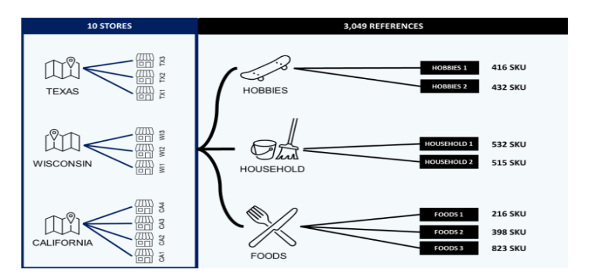
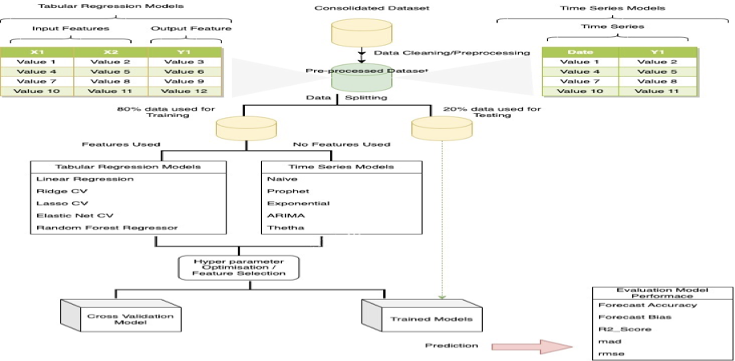

# M5 Forecasting Project

## Table of Contents
1. [Introduction](#introduction)
2. [Dataset Description](#dataset-description)
3. [Installation & Setup](#installation--setup)
4. [Modeling Approach](#modeling-approach)

---

## Introduction
The **M5 Forecasting Competition** challenges participants to predict daily sales of Walmart products using historical data. This project aims to explore various time-series forecasting techniques to achieve optimal performance.

---

## Dataset Description
The dataset includes multiple CSV files:

- **sales_train_validation.csv** – Daily sales data of items.
- **calendar.csv** – Date-related information (e.g., holidays, event flags).
- **sell_prices.csv** – Historical price data of items.
- **sample_submission.csv** – Submission format for the competition.

---

## Installation & Setup
``` python
    %pip install feature_engine
    %pip install sktime
    %pip install darts
```

---

## Modeling Approach

Walmart Retail Good Information




Methodology

